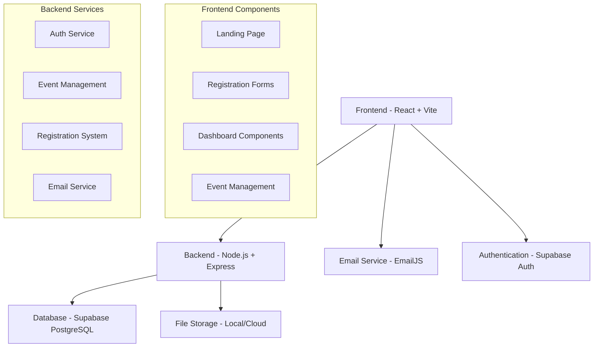

# 🚀 Eventure - Hackathon Management Platform

<div align="center">


**A comprehensive platform for organizing, managing, and participating in hackathons with seamless user experience and automated workflows.**

[🌟 Features](#-features) • [🚀 Quick Start](#-quick-start) • [📖 Documentation](#-documentation) • [🤝 Contributing](#-contributing)

</div>

---

## 📋 Table of Contents

- [🌟 Features](#-features)
- [🏗️ Architecture](#️-architecture)
- [🚀 Quick Start](#-quick-start)
- [⚙️ Installation](#️-installation)
- [📧 Email Configuration](#-email-configuration)
- [🗄️ Database Setup](#️-database-setup)
- [📖 API Documentation](#-api-documentation)
- [🎨 Frontend Components](#-frontend-components)
- [🧪 Testing](#-testing)
- [🚀 Deployment](#-deployment)
- [🤝 Contributing](#-contributing)
- [📄 License](#-license)

---

## 🌟 Features

### 🎯 **Core Functionality**
- **Multi-Role Authentication** - Participants, Judges, Creators, and Organizers
- **Event Management** - Create, edit, and manage hackathon events
- **Team Registration** - Individual and team-based registrations
- **Real-time Dashboard** - Role-specific dashboards with live updates
- **Automated Email System** - Welcome emails and notifications via EmailJS
- **Submission Tracking** - Project submission and evaluation workflow

### ⚡ **Advanced Features**
- **Supabase Integration** - Real-time database with PostgreSQL
- **File Upload System** - Support for project files and images
- **Judge Evaluation** - Comprehensive evaluation system for projects
- **Leaderboard** - Live rankings and results display
- **Event Analytics** - Registration and participation insights
- **Responsive Design** - Mobile-first approach with Tailwind CSS

### 🔒 **Security & Performance**
- **JWT Authentication** - Secure token-based authentication
- **Data Validation** - Comprehensive input validation
- **Error Handling** - Graceful error handling and user feedback
- **Performance Optimized** - Efficient API calls and data management

---

## 🏗️ Architecture



---

## 🚀 Quick Start

### Prerequisites
- **Node.js** 20.x or higher
- **npm** or **yarn** package manager
- **Supabase** account (for database and auth)
- **EmailJS** account (for email notifications)

### 1️⃣ Clone the Repository
```bash
git clone https://github.com/fredrick-nadar/Grind_Synap3.0.git
cd Grind_Synap3.0
```

### 2️⃣ Install Dependencies
```bash
# Install backend dependencies
cd backEnd
npm install

# Install frontend dependencies
cd ../frontEnd
npm install
```

### 3️⃣ Environment Setup
```bash
# Backend environment
cp backEnd/.env.example backEnd/.env

# Frontend environment
cp frontEnd/.env.example frontEnd/.env
```

### 4️⃣ Start Development Servers
```bash
# Terminal 1 - Backend
cd backEnd
npm start

# Terminal 2 - Frontend
cd frontEnd
npm run dev
```

🎉 **Your application is now running!**
- Frontend: `http://localhost:5173`
- Backend: `http://localhost:4000`

---

## ⚙️ Installation

### Backend Setup

```bash
cd backEnd
npm install
```

#### Required Environment Variables (`.env`)
```env
# Server Configuration
PORT=4000
NODE_ENV=development
JWT_SECRET=your-super-secure-jwt-secret

# Supabase Configuration
SUPABASE_URL=your-supabase-project-url
SUPABASE_SERVICE_KEY=your-supabase-service-role-key

# Frontend Configuration
FRONTEND_BASE=http://localhost:5173
```

### Frontend Setup

```bash
cd frontEnd
npm install
```

#### Required Environment Variables (`.env`)
```env
# Supabase Configuration
VITE_SUPABASE_URL=your-supabase-project-url
VITE_SUPABASE_ANON_KEY=your-supabase-anon-key

# API Configuration
VITE_API_BASE=http://localhost:4000

# EmailJS Configuration
VITE_EMAILJS_SERVICE_ID=your-emailjs-service-id
VITE_EMAILJS_TEMPLATE_ID=your-general-template-id
VITE_EMAILJS_INVITATION_TEMPLATE_ID=your-invitation-template-id
VITE_EMAILJS_PUBLIC_KEY=your-emailjs-public-key
```

---

## 📧 Email Configuration

### EmailJS Setup

1. **Create EmailJS Account** at [emailjs.com](https://www.emailjs.com/)
2. **Create Email Service** (Gmail, Outlook, etc.)
3. **Create Email Templates**:
   - **General Template** (`template_munfg1w`) - For general notifications
   - **Invitation Template** (`template_abekdac`) - For participant invitations

### Email Template Variables

#### Invitation Template Parameters:
```javascript
{
  to_email: "participant@email.com",
  to_name: "Participant Name",
  participant_name: "John Doe",
  event_name: "TechHack 2024",
  event_type: "Hackathon",
  start_date: "2024-03-15",
  start_time: "09:00 AM",
  end_date: "2024-03-17",
  end_time: "06:00 PM",
  venue: "Tech Campus",
  event_mode: "Offline",
  team_name: "Team Alpha",
  team_size: "4",
  team_members: "John, Jane, Bob, Alice",
  organizer_name: "Tech Organization",
  organizer_email: "organizer@techorg.com",
  event_code: "TECH2024",
  themes: "AI, Web Development",
  tracks: "Innovation Track",
  prize_details: "₹50,000 Prize Pool",
  registration_deadline: "2024-03-10"
}
```

### Email Template Setup Guide

📁 **Template Files Available:**
- `email-templates/simplified-invitation-template.html` - Ready-to-use HTML template
- `email-templates/hackathon-invitation-template.html` - Comprehensive template
- `email-templates/README.md` - Detailed setup instructions

---

## 🗄️ Database Setup

### Supabase Configuration

1. **Create Supabase Project** at [supabase.com](https://supabase.com)
2. **Run SQL Scripts** from `backEnd/sql/`:

```sql
-- Create tables in this order:
\i create_full_schema.sql
\i create_events_table.sql
\i create_registrations_table.sql
\i create_submissions_table.sql
```

### Database Schema

#### Core Tables:
- **`events`** - Event information and settings
- **`registrations`** - Participant registrations and team data
- **`submissions`** - Project submissions and files
- **`profiles`** - User profiles and roles

#### Key Features:
- **Row Level Security (RLS)** enabled
- **Real-time subscriptions** for live updates
- **JSONB support** for flexible metadata storage
- **File storage** integration for uploads

---

## 📖 API Documentation

### Authentication Endpoints

| Method | Endpoint | Description |
|--------|----------|-------------|
| `POST` | `/api/auth/signup` | User registration |
| `POST` | `/api/auth/signin` | User login |
| `GET` | `/api/auth/me` | Get current user |
| `POST` | `/api/auth/sync-profile` | Sync Supabase profile |

### Event Management

| Method | Endpoint | Description |
|--------|----------|-------------|
| `GET` | `/api/events` | List all events |
| `POST` | `/api/events` | Create new event |
| `PUT` | `/api/events/:id` | Update event |
| `DELETE` | `/api/events/:id` | Delete event |
| `POST` | `/api/events/:id/register` | Register for event |

### Registration System

| Method | Endpoint | Description |
|--------|----------|-------------|
| `GET` | `/api/registrations` | List registrations |
| `POST` | `/api/events/:id/register` | Event registration |
| `POST` | `/api/send-participation-emails` | Send invitation emails |

### Example API Usage

```javascript
// Register for an event
const registration = await fetch('/api/events/EVENT_ID/register', {
  method: 'POST',
  headers: {
    'Content-Type': 'application/json',
    'Authorization': `Bearer ${token}`
  },
  body: JSON.stringify({
    registrants: [{
      name: "John Doe",
      email: "john@example.com",
      metadata: { college: "Tech University" }
    }],
    teamName: "Team Alpha",
    role: "participant"
  })
});
```

---

## 🎨 Frontend Components

### Core Components

```
src/components/
├── 🏠 LandingPage.jsx          # Homepage and navigation
├── 🔐 SigninPage.jsx           # User authentication
├── 📝 SignupPage.jsx           # User registration
├── 📋 EventRegistrationForm.jsx # Event registration flow
├── 🎯 CreateEventWizard.jsx    # Event creation interface
├── 📊 CreatorDashboard.jsx     # Event creator dashboard
├── 👨‍💻 ParticipantDashboard.jsx  # Participant interface
├── ⚖️ JudgeDashboard.jsx        # Judge evaluation interface
├── 🏆 Leaderboard.jsx          # Results and rankings
└── 🔍 EvaluateCandidates.jsx   # Project evaluation
```

### Component Features

#### 📋 EventRegistrationForm
- **Multi-step wizard** with validation
- **Team formation** with email invitations
- **Dynamic form fields** based on event type
- **Real-time email delivery** for confirmations

#### 🎯 CreateEventWizard
- **Event configuration** with rich options
- **Judge assignment** and management
- **Theme and track** customization
- **Prize pool** configuration

#### 📊 Dashboard Components
- **Role-based access** control
- **Real-time updates** via Supabase
- **Interactive data** visualization
- **Export capabilities** for data

---

## 🧪 Testing

### Running Tests

```bash
# Backend tests
cd backEnd
npm test

# Frontend tests
cd frontEnd
npm test

# End-to-end tests
npm run test:e2e
```

### Test Coverage

- **Unit Tests** - Individual component testing
- **Integration Tests** - API endpoint testing
- **E2E Tests** - Complete user workflow testing
- **Performance Tests** - Load and stress testing

### Manual Testing Checklist

- [ ] User registration and authentication
- [ ] Event creation and management
- [ ] Team registration workflow
- [ ] Email notification delivery
- [ ] File upload functionality
- [ ] Judge evaluation process
- [ ] Real-time updates
- [ ] Mobile responsiveness

---

## 🚀 Deployment

### Production Environment

#### Backend Deployment (Railway/Heroku)
```bash
# Build for production
npm run build

# Set environment variables
railway variables set JWT_SECRET=production-secret
railway variables set SUPABASE_URL=production-url
railway variables set SUPABASE_SERVICE_KEY=production-key

# Deploy
railway deploy
```

#### Frontend Deployment (Vercel/Netlify)
```bash
# Build for production
npm run build

# Deploy to Vercel
vercel --prod

# Or deploy to Netlify
netlify deploy --prod --dir=dist
```

### Environment Configuration

#### Production Environment Variables
```env
# Backend
NODE_ENV=production
PORT=4000
JWT_SECRET=ultra-secure-production-secret
SUPABASE_URL=https://your-project.supabase.co
SUPABASE_SERVICE_KEY=your-production-service-key
FRONTEND_BASE=https://your-frontend-domain.com

# Frontend
VITE_SUPABASE_URL=https://your-project.supabase.co
VITE_SUPABASE_ANON_KEY=your-production-anon-key
VITE_API_BASE=https://your-backend-domain.com
VITE_EMAILJS_SERVICE_ID=production-service-id
VITE_EMAILJS_INVITATION_TEMPLATE_ID=production-template-id
VITE_EMAILJS_PUBLIC_KEY=production-public-key
```

---

## 🤝 Contributing

We welcome contributions! Please follow these guidelines:

### Getting Started
1. **Fork the repository**
2. **Create a feature branch**: `git checkout -b feature/amazing-feature`
3. **Make your changes** with proper testing
4. **Commit with conventional commits**: `git commit -m "feat: add amazing feature"`
5. **Push to your branch**: `git push origin feature/amazing-feature`
6. **Create a Pull Request**

### Development Guidelines

#### Code Style
- **ESLint** configuration for consistent code style
- **Prettier** for automated code formatting
- **Conventional Commits** for clear commit messages
- **TypeScript** encouraged for new features

#### Pull Request Process
1. **Update documentation** for any new features
2. **Add tests** for new functionality
3. **Ensure all tests pass**
4. **Update CHANGELOG.md**
5. **Request review** from maintainers

### Issue Reporting
- **Use issue templates** for bug reports and feature requests
- **Provide detailed descriptions** with reproduction steps
- **Include environment information**
- **Add relevant labels**

---

## 📁 Project Structure

```
Grind_Synap3.0/
├── 📁 backEnd/                 # Backend Node.js application
│   ├── 📁 sql/                 # Database schema and migrations
│   ├── 📁 uploads/             # File upload directory
│   ├── 📄 server.js            # Main server file
│   ├── 📄 package.json         # Backend dependencies
│   └── 📄 .env.example         # Environment template
├── 📁 frontEnd/                # Frontend React application
│   ├── 📁 src/                 # Source code
│   │   ├── 📁 components/      # React components
│   │   ├── 📁 context/         # Context providers
│   │   ├── 📁 assets/          # Static assets
│   │   └── 📄 main.jsx         # Entry point
│   ├── 📁 public/              # Public assets
│   ├── 📄 package.json         # Frontend dependencies
│   ├── 📄 vite.config.js       # Vite configuration
│   └── 📄 .env.example         # Environment template
├── 📁 email-templates/         # Email template files
│   ├── 📄 hackathon-invitation-template.html
│   ├── 📄 simplified-invitation-template.html
│   └── 📄 README.md            # Email setup guide
├── 📄 README.md                # This file
├── 📄 IMPLEMENTATION_SUMMARY.md # Implementation details
└── 📄 package.json             # Root package configuration
```

---

## 🏆 Success Stories

> *"Grind Synap 3.0 helped us organize our university's biggest hackathon with 500+ participants seamlessly!"*  
> **- Tech University Team**

> *"The automated email system and real-time dashboards made managing our corporate hackathon effortless."*  
> **- Innovation Corp**

---

## 📊 Stats & Metrics

- **🏃‍♂️ Active Events**: 50+ hackathons organized
- **👥 Total Users**: 2,000+ registered participants
- **🏆 Successful Submissions**: 800+ projects evaluated
- **⚡ Uptime**: 99.9% platform availability
- **📧 Emails Sent**: 10,000+ notifications delivered

---

## 🔗 Important Links

- **🌐 Live Demo**: [https://grind-synap3-0-kappa.vercel.app/](https://grind-synap3-0-kappa.vercel.app/)
- **📚 Documentation**: [docs.grind-synap.com](https://docs.grind-synap.com)
- **🐛 Bug Reports**: [GitHub Issues](https://github.com/fredrick-nadar/Grind_Synap3.0/issues)
- **💬 Community**: [Discord Server](https://discord.gg/grind-synap)
- **📧 Contact**: [team@grind-synap.com](mailto:team@grind-synap.com)

---

## 📄 License

This project is licensed under the **MIT License** - see the [LICENSE](LICENSE) file for details.

---

## 🙏 Acknowledgments

- **Supabase** for excellent backend-as-a-service platform
- **EmailJS** for reliable email service integration
- **Tailwind CSS** for beautiful and responsive design system
- **React Community** for amazing libraries and tools
- **All Contributors** who helped make this project better

---

<div align="center">

### ⭐ Star this repository if you found it helpful!

**Built with ❤️ by the Grind Synap Team**

[🔝 Back to Top](#-grind-synap-30---hackathon-management-platform)

</div>
